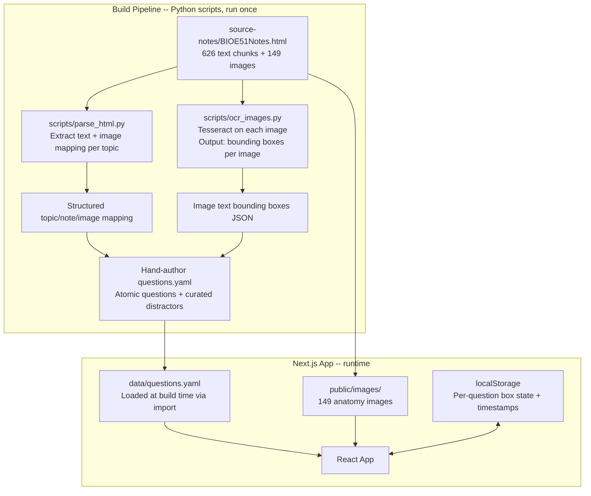
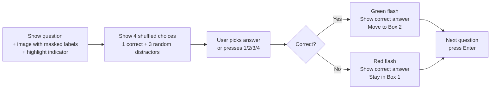
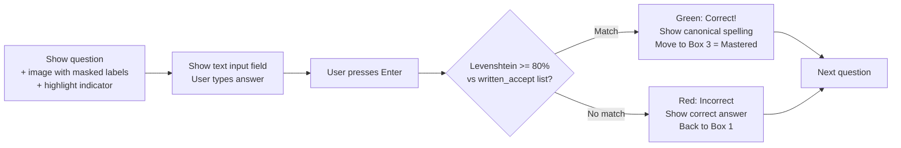
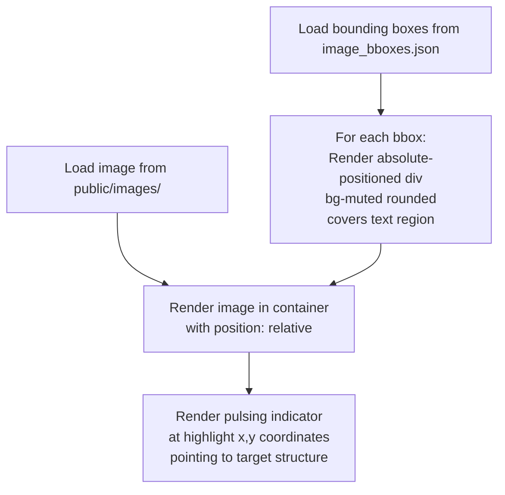
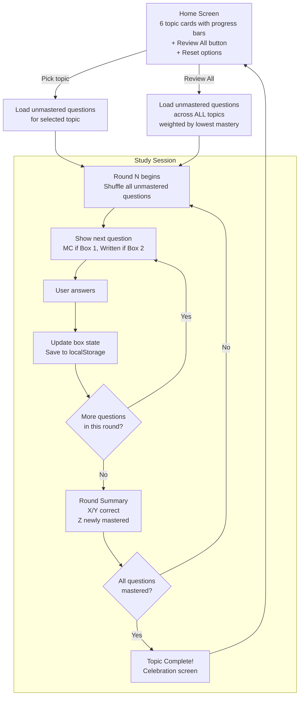
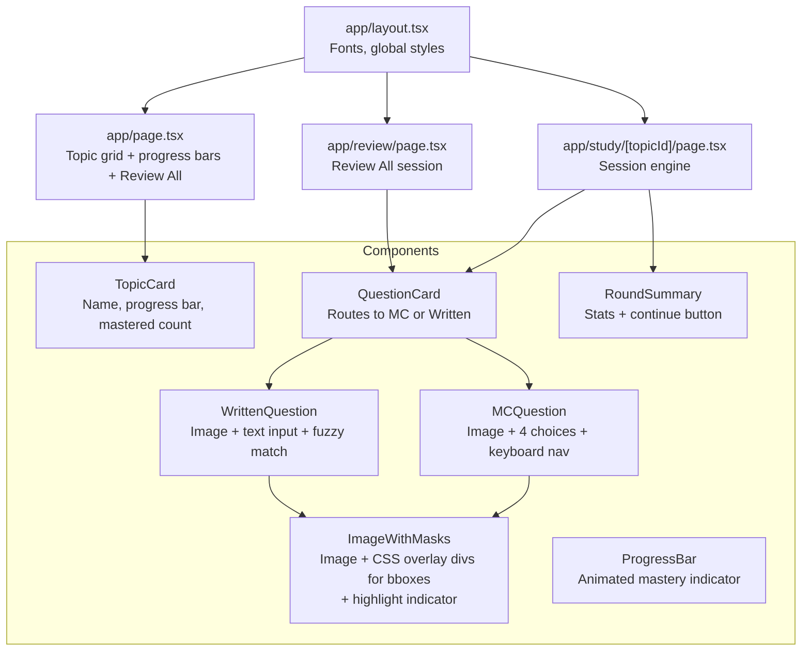

# BIOE 51 Study App for Katy

## Architecture Overview



## Data Pipeline (Phase 1)

### Step 1: Install Python dependencies

```bash
pip3 install pytesseract Pillow beautifulsoup4 pyyaml
```

Tesseract 5.4.1 is already installed at `/opt/homebrew/bin/tesseract`.

### Step 2: Parse HTML into structured topic map

Script: `scripts/parse_html.py`

- Parse [source-notes/BIOE51Notes.html](source-notes/BIOE51Notes.html) with BeautifulSoup
- Split content into 6 topics by detecting section headers:
  1. Intro and Body Orientation
  2. Anatomical Movements
  3. Thorax 1
  4. Thorax 2
  5. Upper Limb 1
  6. Upper Limb 2
- For each topic, extract ordered list of: text notes (bullet points, definitions, facts) and image references (`image53.png`, etc.) with their surrounding text context
- Output: `scripts/output/topic_map.json`

### Step 3: OCR all images for text bounding boxes

Script: `scripts/ocr_images.py`

- Run Tesseract on each of the 149 images in `source-notes/images/`
- Extract word-level bounding boxes (using `pytesseract.image_to_data()`)
- Group nearby words into label regions (cluster words within ~20px vertical proximity)
- Output: `scripts/output/image_bboxes.json` -- keyed by image filename, value is array of `{ text, x, y, w, h }` as percentage-of-image coordinates (so they scale with any render size)

### Step 4: Copy images to public directory

```bash
cp source-notes/images/* public/images/
```

### Step 5: Hand-author the question bank

File: `data/questions.yaml`

This is the core intellectual work. Every atomic fact from Katy's notes becomes a question. The YAML schema:

```yaml
topics:
  - id: "intro-body-orientation"
    name: "Intro & Body Orientation"
    questions:
      - id: "ibo-001"
        type: "image-identify"        # image with masked labels
        image: "image53.png"
        masks: "all"                   # mask all OCR-detected text
        highlight:                     # arrow/indicator pointing to target
          x: 45                        # percentage
          y: 32
        question: "What type of muscle is shown here?"
        answer: "Skeletal muscle"
        written_accept:                # fuzzy match targets for written mode
          - "skeletal muscle"
          - "skeletal"
        distractors:
          - "Cardiac muscle"
          - "Smooth muscle"
          - "Connective tissue"

      - id: "ibo-002"
        type: "text-mc"               # pure text question
        question: "What connects muscle to bone?"
        answer: "Tendon"
        written_accept:
          - "tendon"
          - "tendons"
        distractors:
          - "Ligament"
          - "Cartilage"
          - "Periosteum"
          - "Fascia"

      - id: "ibo-003"
        type: "image-identify"
        image: "image8.png"
        masks: "all"
        highlight:
          x: 50
          y: 85
        question: "What joint is indicated?"
        answer: "Glenohumeral joint"
        written_accept:
          - "glenohumeral joint"
          - "glenohumeral"
          - "shoulder joint"
        distractors:
          - "Acromioclavicular joint"
          - "Sternoclavicular joint"
          - "Scapulothoracic joint"
```

Key rules for authoring:
- **Only Katy's notes** generate questions -- if she didn't write it down, it's not a question
- **Atomic**: one fact per question, never compound
- **Curated distractors**: always same category/region (muscles with muscles, joints with joints, nerves with nerves)
- **3-5 distractors per question**: runtime picks 3 randomly + correct answer = 4 choices shuffled
- **written_accept**: list of acceptable fuzzy match targets (lowercase)
- **image-identify questions**: reference an image file + use `masks: "all"` to block all OCR text + a highlight coordinate pointing to the structure being asked about

## Question Type Flows (Phase 2)

### Multiple Choice Flow (Box 1)



### Written Mode Flow (Box 2)



### Image Masking at Render Time



The masking is pure CSS -- `<div>` overlays positioned absolutely over the image using percentage coordinates from the OCR data. No canvas manipulation needed.

## Session Flow (Phase 3)



## localStorage Schema

```typescript
interface StudyProgress {
  version: 1;
  questions: Record<string, {
    box: 1 | 2 | 3;          // Leitner box (3 = mastered)
    timesSeen: number;
    timesCorrect: number;
    lastSeen: string;         // ISO timestamp
  }>;
}
```

Stored under key `"katy-study-progress"`. Loaded on app mount, written after every answer.

## Component Architecture



### Key files to create

| File | Purpose |
|------|---------|
| `scripts/parse_html.py` | Parse HTML export into structured topic map |
| `scripts/ocr_images.py` | Tesseract OCR on all images, output bounding boxes |
| `data/questions.yaml` | Complete question bank (~200-400 questions) |
| `data/image_bboxes.json` | OCR bounding boxes for all 149 images |
| `lib/questions.ts` | Load + type the YAML data |
| `lib/study-engine.ts` | Leitner box logic, round management, question selection |
| `lib/fuzzy-match.ts` | Levenshtein distance for written mode |
| `lib/use-progress.ts` | localStorage hook for persisting progress |
| `app/page.tsx` | Home screen with topic cards + progress |
| `app/study/[topicId]/page.tsx` | Study session page |
| `app/review/page.tsx` | Review All session page |
| `components/question-card.tsx` | Routes between MC and Written modes |
| `components/mc-question.tsx` | Multiple choice UI + keyboard shortcuts |
| `components/written-question.tsx` | Text input + fuzzy match feedback |
| `components/image-with-masks.tsx` | Image renderer with CSS text masking |
| `components/round-summary.tsx` | End-of-round stats |
| `components/topic-card.tsx` | Topic selection card with progress |

### shadcn components to install

```bash
npx shadcn@latest add card progress badge input separator alert
```

These cover: topic cards (Card), mastery bars (Progress), status indicators (Badge), written answer input (Input), layout dividers (Separator), and feedback messages (Alert).

## Design Details

- **Warm amber theme**: Already configured in [app/globals.css](app/globals.css) with oklch amber tokens
- **Encouraging feedback**: Green pulse animation on correct, gentle red shake on incorrect, always show correct answer
- **Progress bars**: Amber-filled progress bars on each topic card showing mastered/total
- **Round summaries**: Celebratory tone ("Nice! 8 new questions mastered this round")
- **Keyboard-first**: 1/2/3/4 for MC answers, Enter to submit written answers and advance, Escape to quit session
- **Responsive**: Works on laptop and phone (Katy might study from either)

## Execution Order

The work breaks into 3 phases that must be sequential:

**Phase 1 -- Data pipeline** (highest risk, do first)
1. Install Python deps
2. Write + run `parse_html.py` to understand the full note structure
3. Write + run `ocr_images.py` to get bounding boxes for all 149 images
4. Copy images to `public/images/`
5. Author `questions.yaml` -- the bulk of the work, requires reading every note and image

**Phase 2 -- App infrastructure**
1. Install shadcn components
2. Build `lib/` modules (questions loader, study engine, fuzzy match, progress hook)
3. Build `ImageWithMasks` component (the core visual mechanic)

**Phase 3 -- Pages and UX**
1. Home page with topic cards + progress
2. Study session page with round logic
3. Review All page
4. Feedback animations, keyboard shortcuts
5. Test the full flow end-to-end
